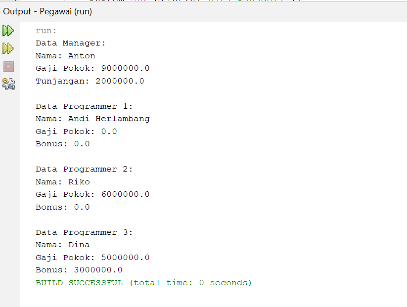

# Praktikum_5

| keterangan | Data |
| ---- | ---- |
| Nama | Laras Sakti |
| Kelas | TI.23.A6 |
| Nim | 312310627 |
| Mata Kuliah | Pemograman Orientasi Objek |

# Latihan

## Class Pegawai

~~~
package pegawai;

public class Pegawai {
    private String nama;
    private double gajiPokok;

    // Konstruktor
    public Pegawai() {
    }

    public Pegawai(String nama, double gajiPokok) {
        this.nama = nama;
        this.gajiPokok = gajiPokok;
    }

    // Setter dan getter nama
    public String getNama() {
        return nama;
    }
    public void setNama(String nama) {
        this.nama = nama;
    }

    // Setter dan getter gajiPokok
    public double getGajiPokok() {
        return gajiPokok;
    }
    public void setGajiPokok(double gajiPokok) {
        this.gajiPokok = gajiPokok;
    }

    // Mencetak informasi Pegawai
    public void cetakInfo() {
        System.out.println("Nama: " + nama);
        System.out.println("Gaji Pokok: " + gajiPokok);
    }
}

~~~

## Class Manager

~~~

package pegawai;

public class Manager extends Pegawai {
    private double tunjangan;

    // Konstruktor 
    public Manager() {
    }
    public Manager(String nama, double gajiPokok, double tunjangan) {
        super(nama, gajiPokok); // Memanggil konstruktor kelas induk
        this.tunjangan = tunjangan;
    }

    // Setter dan getter tunjangan
    public double getTunjangan() {
        return tunjangan;
    }
    public void setTunjangan(double tunjangan) {
        this.tunjangan = tunjangan;
    }

    @Override
    public void cetakInfo() {
        super.cetakInfo();
        System.out.println("Tunjangan: " + tunjangan);
    }
}

~~~

## Class Programmer

~~~

package pegawai;

public class Programmer extends Pegawai {
    private double bonus;

    // Konstruktor
    public Programmer() {
    }
    // Overloading konstruktor  Programmer
    public Programmer(String nama) {
        super(nama, 0); // Mengatur gajiPokok default 0
    }

    public Programmer(String nama, double gajiPokok) {
        super(nama, gajiPokok);
    }

    public Programmer(String nama, double gajiPokok, double bonus) {
        super(nama, gajiPokok); // Memanggil konstruktor kelas induk
        this.bonus = bonus;
    }

    // Setter dan getter bonus
    public double getBonus() {
        return bonus;
    }
    public void setBonus(double bonus) {
        this.bonus = bonus;
    }

    @Override
    public void cetakInfo() {
        super.cetakInfo();
        System.out.println("Bonus: " + bonus);
    }
}

~~~

## Class Main

~~~

package pegawai;

public class PegawaiBeraksi {
    public static void main(String[] args) {
        // Menggunakan overloaded konstruktor membuat objek manager dan programmer
        Manager manager = new Manager("Anton", 9000000, 2000000);
        System.out.println("Data Manager:");
        manager.cetakInfo();

        Programmer programmer1 = new Programmer("Andi Herlambang");
        System.out.println("\nData Programmer 1:");
        programmer1.cetakInfo();

        Programmer programmer2 = new Programmer("Riko", 6000000);
        System.out.println("\nData Programmer 2:");
        programmer2.cetakInfo();

        Programmer programmer3 = new Programmer("Dina", 5000000, 3000000);
        System.out.println("\nData Programmer 3:");
        programmer3.cetakInfo();
    }
}

~~~

# Output

# Sistem pembelian online

## class Produk

~~~
package marketzz;

public class Produk {
    private String namaProduk;
    private double harga;
    private int jumlahStok;

    public Produk(String namaProduk, double harga, int jumlahStok) {
        this.namaProduk = namaProduk;
        this.harga = harga;
        this.jumlahStok = jumlahStok;
    }

    public String getNamaProduk() {
        return namaProduk;
    }

    public double getHarga() {
        return harga;
    }

    public int getJumlahStok() {
        return jumlahStok;
    }

    public void kurangiStok(int jumlah) {
        if (jumlah <= jumlahStok) {
            jumlahStok -= jumlah;
        }
    }

    public void displayInfo() {
        System.out.println("Nama Produk: " + namaProduk);
        System.out.println("Harga: " + harga);
        System.out.println("Jumlah Stok: " + jumlahStok);
    }
}

~~~

## SubClass Elektronik

~~~

package marketzz;

public class Elektronik extends Produk {
    private int garansi; // dalam tahun

    public Elektronik(String namaProduk, double harga, int jumlahStok, int garansi) {
        super(namaProduk, harga, jumlahStok);
        this.garansi = garansi;
    }

    @Override
    public void displayInfo() {
        super.displayInfo();
        System.out.println("Garansi: " + garansi + " tahun");
    }
}

~~~

## SubClass Pakaian

~~~

package marketzz;

public class Pakaian extends Produk {
    private String ukuran;
    private String warna;

    public Pakaian(String namaProduk, double harga, int jumlahStok, String ukuran, String warna) {
        super(namaProduk, harga, jumlahStok);
        this.ukuran = ukuran;
        this.warna = warna;
    }

    @Override
    public void displayInfo() {
        super.displayInfo();
        System.out.println("Ukuran: " + ukuran);
        System.out.println("Warna: " + warna);
    }
}

~~~

# SubClass Makanan

~~~

package marketzz;

import java.util.Date;

public class Makanan extends Produk {
    private Date tanggalKadaluwarsa;

    public Makanan(String namaProduk, double harga, int jumlahStok, Date tanggalKadaluwarsa) {
        super(namaProduk, harga, jumlahStok);
        this.tanggalKadaluwarsa = tanggalKadaluwarsa;
    }

    @Override
    public void displayInfo() {
        super.displayInfo();
        System.out.println("Tanggal Kadaluwarsa: " + tanggalKadaluwarsa);
    }
}

~~~

## Class KeranjangBelanja

~~~

package keranjang;

import marketzz.Produk;
import java.util.ArrayList;
import java.util.List;

public class KeranjangBelanja {
    private List<Produk> produkList;

    public KeranjangBelanja() {
        this.produkList = new ArrayList<>();
    }

    public void tambahProduk(Produk produk, int jumlah) {
        if (produk.getJumlahStok() >= jumlah) {
            produk.kurangiStok(jumlah);
            produkList.add(produk);
            System.out.println(jumlah + " " + produk.getNamaProduk() + " berhasil ditambahkan ke keranjang.");
        } else {
            System.out.println("Stok tidak mencukupi untuk produk: " + produk.getNamaProduk());
        }
    }

    public double hitungTotalBelanja() {
        double total = 0;
        for (Produk produk : produkList) {
            total += produk.getHarga();
        }
        return total;
    }

    public void displayKeranjang() {
        System.out.println("Isi Keranjang Belanja:");
        for (Produk produk : produkList) {
            produk.displayInfo();
            System.out.println("-----------------------");
        }
        System.out.println("Total Belanja: Rp " + hitungTotalBelanja());
    }
}

~~~

## Class Main

~~~

package marketmain;

import marketzz.Elektronik;
import marketzz.Pakaian;
import marketzz.Makanan;
import keranjang.KeranjangBelanja;
import java.util.Date;

public class Main {
    public static void main(String[] args) {
        // Membuat beberapa objek produk
        Elektronik tv = new Elektronik("Televisi", 3000000, 10, 2);
        Pakaian kaos = new Pakaian("Kaos Polos", 50000, 20, "L", "Putih");
        Makanan roti = new Makanan("Roti Tawar", 15000, 50, new Date());

        // Membuat objek keranjang belanja
        KeranjangBelanja keranjang = new KeranjangBelanja();

        // Menambahkan produk ke keranjang
        keranjang.tambahProduk(tv, 1);
        keranjang.tambahProduk(kaos, 2);
        keranjang.tambahProduk(roti, 5);

        // Menampilkan isi keranjang dan total belanja
        keranjang.displayKeranjang();
    }
}

~~~

# Output

